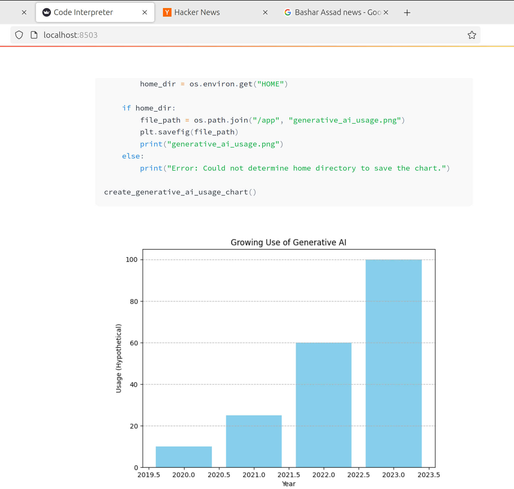

# 🚀 Code Interpreter Demo Application

Demo app with Code Interpreter.
Adding Code Interpreter to an application using Large Language models/Generative AI models unlocks a world of possibilities. 
In this vide, we'll learn how to implement code interpreter that runs on your local machine as well as on Docker container for safely executing the code.

## 📸 App Screenshots

Below are the screenshots of the app in action:

<p float="left">
  
  
</p>

## 🔨 Setting up locally

Follow these steps to set up and run the app locally:

### 1. Install Dependencies

Create a virtual environment and install dependencies:

```bash
pip install pipenv

pipenv install

pipenv run pip install -r requirements.txt

```

### 2. Run the App

```bash

pipenv run streamlit app.py

```

### 3. Build Docker Image

```bash

docker build -t code-interpreter-demo .

```

### 4. Ask a Question

Then ask your question like query.txt

